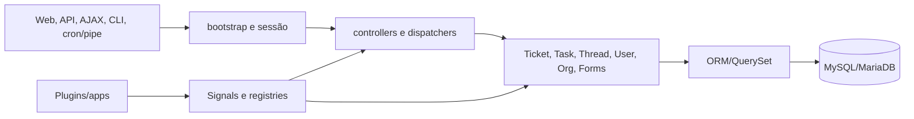

# Arquitetura da baseline

## Síntese canônica

O osTicket v1.18.4 é uma aplicação PHP modular por includes, entrypoints e
classes de domínio, com persistência ORM própria e dispatchers HTTP/AJAX. Não
há container de injeção, camada de serviços uniforme nem fronteira transacional
global observada.

## Índice arquitetural

| Dimensão | Documento canônico detalhado |
| --- | --- |
| árvore e ownership | [inventário](INVENTORY.md) e [proveniência](PROVENANCE_MAP.md) |
| componentes | [mapa de componentes](COMPONENT_MAP.md) |
| entrada/bootstrap | [entrypoints](ENTRYPOINT_CATALOG.md) e [ciclo de requisição](REQUEST_LIFECYCLE.md) |
| superfícies HTTP | [HTTP](HTTP_SURFACES.md), [API](API_ANALYSIS.md) e [AJAX](AJAX_ROUTE_CATALOG.md) |
| domínio | [ticket](TICKET_LIFECYCLE.md), [falhas/órfãos](INTEGRITY_FAILURES.md) e [subsistemas](TRANSVERSAL_SUBSYSTEMS.md) |
| persistência | [banco](DATABASE.md), [arquitetura de persistência](DATABASE_ARCHITECTURE.md) e [ORM](ORM_CATALOG.md) |
| segurança | [autenticação](AUTHENTICATION.md) e [modelo de segurança](SECURITY_MODEL.md) |
| extensibilidade | [plugins](PLUGIN_ARCHITECTURE.md), [sinais](SIGNAL_CATALOG.md), [registries](REGISTRY_CATALOG.md) e [customização](CUSTOMIZATION_MATRIX.md) |
| frontend PHP | [análise estática](FRONTEND_ANALYSIS.md) |
| operação | [CLI](CLI_CATALOG.md), [instalação/upgrade](INSTALLATION_UPGRADE.md) e [testes](TESTING_BASELINE.md) |

**Fato observado:** estes documentos descrevem a arquitetura presente. Opções
de API própria, migração e frontend futuro pertencem ao dossiê comparativo e ao
Portão D; não são decisões desta síntese.
