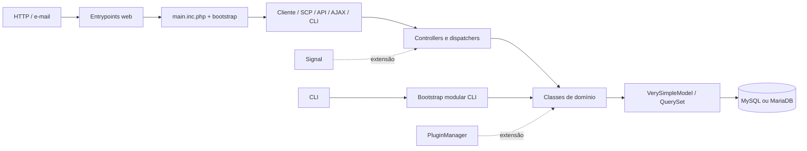

# Mapa inicial de componentes

## Visão por camadas observadas

O diagrama representa localização e dependência aparente. Não afirma ainda que
todas as chamadas respeitam essas camadas.

## Decomposição de `include/`

Na árvore da baseline, `include/` contém 1.835 arquivos:

| Grupo | Arquivos | Classificação inicial |
| --- | ---: | --- |
| `mpdf/` | 667 | biblioteca incorporada para PDF |
| `laminas-mail/` | 444 | biblioteca incorporada para e-mail |
| `staff/` | 186 | templates e includes do painel da equipe |
| `upgrader/` | 132 | fluxo e streams de atualização |
| raiz de `include/` | 130 | classes e controladores centrais |
| `i18n/` | 125 | localização e conteúdo traduzível |
| `pear/` | 104 | bibliotecas PEAR incorporadas |
| `client/` | 28 | templates e includes do portal do usuário |
| `cli/` | 15 | infraestrutura e 14 módulos CLI |
| demais | 4 | `config/`, `fpdf/` e `plugins/` |

Na raiz de `include/` foram observados 94 arquivos `class.*`, 23 `ajax.*`, dois
`api.*` e dez outros PHP. A contagem não representa quantidade de classes, pois
um arquivo pode declarar vários símbolos.

## Componentes centrais localizados

| Componente | Implementação inicial | Responsabilidade observável |
| --- | --- | --- |
| Bootstrap | `bootstrap.php`, `main.inc.php` | ambiente, configuração, tabelas, i18n, classes e conexão |
| Aplicação | `include/class.osticket.php` | início da aplicação e acesso à configuração global |
| HTTP | `include/class.http.php` | respostas, redirects e utilidades HTTP |
| Dispatch | `include/class.dispatcher.php` | padrões, métodos HTTP e resolução de controllers |
| ORM | `include/class.orm.php`, `include/class.model.php` | modelos e consultas |
| Ticket | `include/class.ticket.php` | agregado central de ticket e metadados ORM |
| Thread | `include/class.thread.php` | conversas, entradas, eventos e referências |
| Task | `include/class.task.php` | tarefas e threads associadas |
| Pessoas | `class.user.php`, `class.staff.php`, `class.organization.php` | usuários, agentes e organizações |
| Organização operacional | `class.dept.php`, `class.team.php`, `class.role.php` | departamentos, equipes, papéis e acesso |
| Formulários | `class.dynamic_forms.php` | formulários, campos, entradas e respostas |
| Autenticação | `class.auth.php` | famílias de backends de usuário e equipe |
| Extensão | `class.plugin.php`, `class.signal.php` | plugins, instâncias e sinais |

## Dependências incorporadas

**Fato observado:** bibliotecas de terceiros estão versionadas dentro de
`include/`, inclusive árvores `vendor/`. Elas não devem ser confundidas com o
core em futuras métricas ou documentação automática.

Não existe manifesto Composer na raiz. Laminas Mail e mPDF possuem manifests e
autoloaders próprios incorporados; são carregados explicitamente por
`include/class.email.php:14` e `include/class.pdf.php:16-22`. O core também
usa `include/UniversalClassLoader.php`, carregado por
`include/class.osticket.php:25-26`, e mantém bibliotecas PEAR pelo
`include_path` definido em `bootstrap.php:380-386`.

**Inferência sustentada:** a distribuição combina core, templates, código PEAR,
árvores Composer incorporadas e upgrader em `include/`; métricas e alterações
de dependência devem preservar essas fronteiras.
