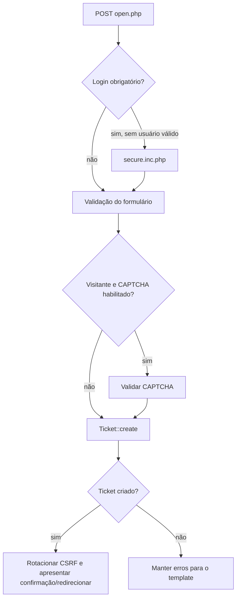

# Superfícies HTTP — leitura estática preliminar

## Escopo e método

Este documento registra o que pode ser comprovado sem instalar ou navegar no
osTicket. A presença de uma rota, condição ou chamada no código não comprova o
comportamento visual nem o resultado em execução.

Foram inspecionados os controladores públicos principais, o login da equipe,
os guardas compartilhados e os dispatchers de API e AJAX. A contagem
reproduzível de `url*(` em `scp/ajax.php` retorna 256 registros sintáticos.
A classificação de folhas permanece em reconciliação por divergência entre o
total especializado e a soma por grupo.

## Portal do usuário

| Controlador | Pré-condição observada | Operações estáticas principais | Evidência |
| --- | --- | --- | --- |
| `index.php` | `client.inc.php` | página inicial e acesso condicional à base de conhecimento | `index.php:16-82` |
| `open.php` | configuração pode exigir login; CAPTCHA para visitante quando habilitado | valida formulário e chama `Ticket::create()` | `open.php:20-102` |
| `view.php` | token, número de ticket ou sessão de usuário | resolve autenticação e redireciona para o ticket | `view.php:17-50` |
| `tickets.php` | `secure.inc.php`; acesso validado por `checkUserAccess()` | listar, visualizar, editar dados permitidos, responder e exportar PDF | `tickets.php:17-149` |
| `login.php` | CSRF em `POST` | senha local, ticket + e-mail, backend externo e sign-on | `login.php:35-153` |
| `pwreset.php` | CSRF em `POST`; token na continuação | solicitar mensagem e concluir redefinição | `pwreset.php:11-98` |
| `account.php` | cadastro de clientes habilitado | criar, importar ou atualizar conta e perfil | `account.php:25-138` |
| `profile.php` | `secure.inc.php`; visitante temporário recusado | atualizar conta e informações do usuário | `profile.php:19-43` |

### Criação de ticket pelo portal

**Fato observado:** `open.php` delega regras de criação a
`Ticket::create()`; o controlador não contém sozinho o contrato completo da
operação (`open.php:20-61`).

## Painel da equipe

`scp/staff.inc.php` é a guarda compartilhada das páginas autenticadas. A leitura
estática comprova:

1. ACL de superfície `staff` em `scp/staff.inc.php:25`;
2. resolução do agente em `scp/staff.inc.php:64`;
3. validação de agente ativo e estado do sistema em `scp/staff.inc.php:71-103`;
4. CSRF obrigatório para `POST`, `PUT`, `PATCH` e `DELETE` em
   `scp/staff.inc.php:106-110`;
5. imposição de troca de senha e configuração de 2FA em
   `scp/staff.inc.php:137-146`.

`scp/tickets.php` combina consulta e mutação. Entre as ações verificadas estão
responder, registrar nota interna, editar, reivindicar, marcar atraso, banir ou
desbanir e-mail, trocar proprietário, adicionar colaborador e abrir ticket. As
permissões não são uniformes: cada ramo deve ser associado ao respectivo
`Ticket::PERM_*`, permissão de e-mail, lock e visibilidade antes de concluir a
matriz de autorização (`scp/tickets.php:159-456`).

## Dispatchers

| Superfície | Registro estático | Extensão anterior à resolução | Guarda observada |
| --- | --- | --- | --- |
| API pública | criação de ticket em `/tickets.(xml|json|email)` e cron em `/tasks/cron` | sinal `api` | `api/api.inc.php`; controles específicos ainda em análise |
| AJAX da equipe | 256 declarações sintáticas em grupos aninhados | sinal `ajax.scp` | `scp/staff.inc.php` e CSRF para métodos mutáveis |
| Aplicações da equipe | `Dispatcher` vazio preenchido por assinantes | `apps.admin` ou `apps.scp` | `staff.inc.php`; `admin.inc.php` no prefixo `/admin/` |

As funções `patterns()`, `url()`, `url_post()`, `url_get()` e `url_delete()`
estão em `include/class.dispatcher.php:179-204`. A ausência de sufixo de método
em uma declaração `url()` não deve ser interpretada como autorização irrestrita
sem examinar o controlador e a guarda da superfície.

## Limites desta leitura

- Estado de menus, respostas renderizadas e JavaScript não foi reproduzido.
- As folhas precisam ser extraídas de modo reproduzível e cruzadas com
  permissões, ownership, persistência e resposta.
- Endpoints adicionados por plugins dependem dos assinantes dos sinais e serão
  cruzados com o inventário de extensibilidade.
- Resultados HTTP, mensagens e efeitos no banco serão confirmados somente na
  fase comportamental autorizada após a instalação.
