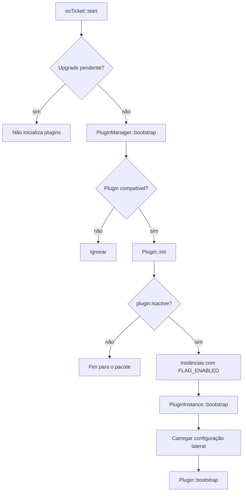

# Arquitetura de plugins

## Cadeia de carregamento

Plugins são inicializados antes de os entrypoints emitirem sinais de dispatcher
(`include/class.osticket.php:676-691`). `PluginManager::bootstrap()` chama
`init()` para todo plugin compatível, inclusive globalmente desabilitado, e só
depois restringe o bootstrap funcional às instâncias habilitadas do pacote
ativo (`include/class.plugin.php:193-207,1159-1165`).

**Implicação factual:** desabilitar globalmente um pacote não impede efeitos que
sua implementação tenha colocado em `init()`.

## Descoberta e manifesto

`PluginManager::allInfos()` percorre `include/plugins/*`, aceita diretórios e
PHARs e exige `plugin.php` (`include/class.plugin.php:271-307`). Esse manifesto
é incluído como PHP por `getInfoForPath()`, não lido como dados passivos
(`include/class.plugin.php:309-330`).

Assim, listar pacotes disponíveis pode executar código do pacote. O diretório de
plugins é fronteira de código confiável. A baseline não distribui plugins:
`include/plugins/` contém somente `.keep` e `updates.pem`.

`Plugin::getImpl()` interpreta `arquivo:classe`, resolve diretório/PHAR,
registra `lib/` no autoloader, inclui a implementação e faz lookup pelo ID
persistido (`include/class.plugin.php:695-714`).

## Estados necessários

| Condição | `init()` | bootstrap da instância |
| --- | --- | --- |
| incompatível | não | não |
| compatível, pacote inativo | sim | não |
| pacote ativo, instância sem flag | sim | não |
| pacote ativo, instância habilitada | sim | sim |

A execução funcional ainda depende de implementação carregável e configuração
disponível.

## Persistência

- `plugin`: pacote instalado, estado global e metadados
  (`include/class.plugin.php:543-553`;
  `setup/inc/streams/core/install-mysql.sql:894-907`).
- `plugin_instance`: instância e flags, relacionada logicamente a `plugin_id`
  (`include/class.plugin.php:1006-1017`;
  `setup/inc/streams/core/install-mysql.sql:909-920`).
- `config`: pares por namespace; cada instância usa
  `plugin.<pluginId>.instance.<instanceId>`
  (`include/class.plugin.php:1110-1114`).

Não há FK SQL entre pacote e instância. `PluginInstance::delete()` remove
configuração antes do registro (`include/class.plugin.php:1167-1170`).
`PluginConfig::pre_save()` permite ao plugin validar ou cifrar, mas o core não
cifra automaticamente valores arbitrários de configuração
(`include/class.plugin.php:138-148`).

## Ciclo administrativo

- instalação valida manifesto/compatibilidade, cria `Plugin`, chama
  `enable()` e limpa caches (`include/class.plugin.php:364-393`);
- o registro nasce inativo e a implementação base não cria instância;
- instâncias são criadas/atualizadas por `addInstance()` e `update()`;
- desinstalação admite veto, remove registros/configuração e preserva arquivos
  do pacote (`include/class.plugin.php:813-896,1136-1152`);
- administração exige `admin.inc.php`; AJAX de plugins também exige
  administrador.

A rotina `PluginManager::isVerified()` existe, mas `install()` não a chama.
Portanto, a baseline não comprova verificação criptográfica obrigatória na
instalação.

## Extensões disponíveis

Plugins carregados podem conectar sinais, acrescentar rotas aos dispatchers,
registrar aplicações na navegação e registrar implementações de autenticação,
2FA, avatar, exportação, tipos de lista, ações de filtro, armazenamento,
permissões, busca e filtros de coluna.

Esses registries são pontos reais de registro, porém ainda não são classificados
como API pública estável.

## Achados para confirmação

| Achado estático | Evidência | Estado |
| --- | --- | --- |
| `init()` roda para plugin compatível inativo | `include/class.plugin.php:193-203` | fato; impacto depende do plugin |
| manifesto executa PHP na descoberta | `include/class.plugin.php:319-328` | fato; fronteira confiável |
| verificação não bloqueia `install()` | `include/class.plugin.php:364-518` | fato na baseline |
| rota aponta para `PluginsAjaxAPI::actions`, método não localizado | `scp/ajax.php:95`; `include/ajax.plugins.php:4-62` | possível defeito; validar depois |
| `Plugin::__onload()` usa chave `verion` | `include/class.plugin.php:583-590` | possível typo; efeito pendente |

Nenhum dos dois últimos itens autoriza correção nesta fase; primeiro serão
comparados com upstream e confirmados em runtime.
