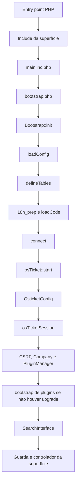
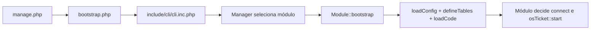

# Ciclos de inicialização e requisição

## Cadeia web comum observada

### Evidências da ordem

1. Portal, equipe e API carregam `main.inc.php` respectivamente em
   `client.inc.php:21`, `scp/staff.inc.php:20` e `api/api.inc.php:32`.
2. `main.inc.php:23-28` inclui `bootstrap.php`, carrega configuração, define
   tabelas, prepara i18n/código e conecta ao banco.
3. A própria inclusão de `bootstrap.php` executa `Bootstrap::init()` em
   `bootstrap.php:393`.
4. `main.inc.php:34-35` chama `osTicket::start()` e exige configuração válida.
5. `osTicket::__construct()` cria, nesta ordem, configuração persistida,
   sessão, CSRF, empresa e gerenciador de plugins
   (`include/class.osticket.php:51-69`).
6. `osTicket::start()` prepara i18n, faz bootstrap dos plugins somente sem
   upgrade pendente e cria a busca (`include/class.osticket.php:676-692`).

## Configuração e banco

`Bootstrap::loadConfig()` procura `include/ost-config.php`, depois os legados
`ostconfig.php` e `include/settings.php` (`bootstrap.php:171-199`). Se não
encontra configuração e `setup/` existe, redireciona ao instalador. O arquivo
selecionado é incluído diretamente; o core não lê o `.env` de homologação.

`Bootstrap::connect()` percorre hosts configurados, admite parâmetros SSL e
seleciona o banco (`bootstrap.php:201-229`). A construção de
`OsticketConfig` consulta itens do namespace `core` na tabela de configuração
(`include/class.config.php:33-50,155-160,218-220`).

## Sessão web

- `osTicketSession::start()` registra o handler e inicia a sessão em
  `include/class.ostsession.php:99-115`.
- O cookie usa `ROOT_PATH`, domínio calculado, `secure` conforme HTTPS e
  `HttpOnly` (`include/class.ostsession.php:30-37`).
- O backend normal é banco; incompatibilidade/upgrade pode selecionar o handler
  PHP `system` (`include/class.ostsession.php:39-45`).
- Há backends `database`, `memcache`, combinações dos dois, `system` e
  `noop` (`include/class.ostsession.php:48-82,139-168`).
- `DatabaseSessionRecord` usa `SESSION_TABLE` e PK `session_id`
  (`include/class.ostsession.php:302-307`).
- O fechamento emite `session.close` (`include/class.ostsession.php:126-131`).

Sessões da API são marcadas por `API_SESSION` (`api/api.inc.php:18-30`). Novas
sessões API não são persistidas, embora uma sessão existente possa ser
atualizada (`include/class.session.php:193-240`).

## Guardas por superfície

| Superfície | ACL/autenticação | CSRF e controles adicionais |
| --- | --- | --- |
| Cliente | ACL `client`; `UserAuthenticationBackend::getUser()` | CSRF para métodos mutáveis; `secure.inc.php` exige identidade |
| Equipe | ACL `staff`; `StaffAuthenticationBackend::getUser()` | CSRF mutável; estado ativo, senha obrigatória e 2FA |
| API HTTP | API key cruzada com IP e permissões por operação | autenticação ocorre nos métodos dos controllers |
| AJAX | herda a guarda cliente ou equipe | alguns controllers adicionam `access()`, mas a base é permissiva |

`Controller::access()` retorna `true` por padrão e é chamado antes do método da
rota (`include/class.controller.php:14-24`;
`include/class.dispatcher.php:139-146`). Portanto, herança por si só não prova
autorização; cada rota precisa ser cruzada com a guarda e o controlador.

## Dispatcher

`Dispatcher::resolve()` admite emulação de `PUT`, `PATCH` e `DELETE` pelo campo
`_method`, decodifica a URL, usa a primeira rota correspondente e retorna HTTP
400 quando nenhuma casa (`include/class.dispatcher.php:29-46`). Rotas lazy
incluem o arquivo no primeiro acesso e controllers no formato
`arquivo.php:Classe` são instanciados sem argumentos
(`include/class.dispatcher.php:67-84,106-175`).

## API, cron e pipe

- `.htaccess` de `api/` reescreve caminhos não físicos para `api/http.php`.
- O core registra `POST /tickets.{xml|json|email}` e `POST /tasks/cron`; o sinal
  `api` permite acréscimos (`api/http.php:19-29`).
- A autenticação do ticket e do cron ocorre em
  `include/api.tickets.php:113-125` e `include/api.cron.php:5-12`.
- A API key de `X-API-Key` é cruzada com IP e banco; permissões para tickets e
  cron são separadas (`include/class.api.php:68-78,192-214`).
- `api/cron.php` e `api/pipe.php` são exclusivos de CLI; o cron local executa
  `run()` sem API key (`api/cron.php:19-23`, `api/pipe.php:21-26`,
  `include/api.cron.php:23-46`).

## Cadeia CLI — exceção deliberada

`manage.php` não carrega `main.inc.php` (`manage.php:21-27`). O bootstrap base
do módulo não conecta nem inicia a aplicação (`include/class.cli.php:235-251`):
essas ações são seletivas. Nove módulos chamam `Bootstrap::connect()` (`agent`,
`cron`, `export`, `file`, `import`, `list`, `org`, `upgrade`, `user`) e seis
chamam `osTicket::start()` (`agent`, `cron`, `export`, `file`, `upgrade` e,
condicionalmente, `user`).

## Lacunas para análise posterior

- validar rewrite, `PATH_INFO`, cookies e handlers somente após instalação;
- normalizar todas as rotas AJAX e verificações internas;
- revisar em segurança a divergência entre o comentário e `display_errors=1`
  em `bootstrap.php:23-31`;
- testar condições de sessão durante upgrade sem antecipar conclusões estáticas.
