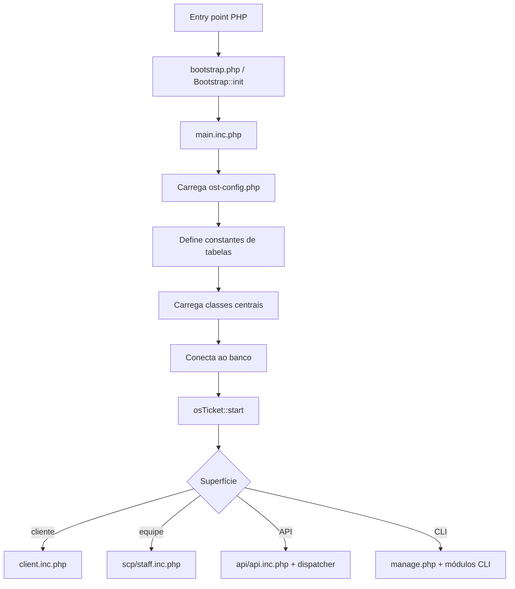

# Ciclo inicial de requisição

## Cadeia comum observada

## Evidências

1. `main.inc.php:23` exige `bootstrap.php`.
2. `main.inc.php:24-28` chama `loadConfig()`, `defineTables()`, `i18n_prep()`,
   `loadCode()` e `connect()`.
3. `main.inc.php:34` inicia a aplicação com `osTicket::start()` e obtém a
   configuração persistida.
4. `client.inc.php:21` inclui o bootstrap comum e depois resolve autenticação do
   usuário em `client.inc.php:52`.
5. `scp/staff.inc.php:17` inclui o bootstrap comum; o arquivo valida ACL,
   autenticação da equipe, estado do sistema e CSRF para métodos mutáveis.
6. `api/api.inc.php` define `API_SESSION` e `APICALL`, carrega `main.inc.php` e a
   infraestrutura de API.
7. `api/http.php:18-29` constrói e resolve o dispatcher, permitindo extensão
   pelo sinal `api`.

## Inferências a confirmar

- A maior parte das superfícies web converge no mesmo estado global iniciado em
  `main.inc.php`, mas as diferenças de sessão e autorização exigem rastreamento
  separado.
- Sinais emitidos antes da resolução dos dispatchers podem constituir pontos de
  extensão, porém alcance, ordem e garantias ainda não estão comprovados.
