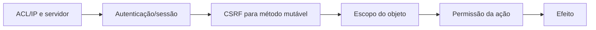

# Modelo de segurança — análise estática

## Camadas de controle

Permissões não formam middleware uniforme. Cada operação precisa cruzar guarda
da superfície, identidade, escopo do objeto e `PERM_*` do método.

## Identidade e credenciais

- agentes: backends registrados, login local por `StaffSession`, sessão
  revalidada contra backend, atividade e ID
  (`include/class.auth.php:324-367,625-720`);
- clientes: login local por `ClientAccount`, conta confirmada/ativa e sessão
  revalidada (`include/class.auth.php:836-938,1440-1461`);
- hashing: phpass/bcrypt, custo padrão 8; MD5 legado é migrado no login
  (`include/class.passwd.php:17-40`, `include/class.client.php:410-419`,
  `include/class.staff.php:223-251`);
- alteração de senha emite `auth.clean`, que tenta remover outras sessões.

Contadores de falha observados residem na sessão PHP. **Inferência:** trocar
sessão ou distribuir tentativas pode reduzir o bloqueio; confirmar antes de
classificar como defeito.

## Sessão, cookie e CSRF

O cookie inicial usa caminho/domínio calculados, `Secure` conforme HTTPS e
`HttpOnly`; renovações definem `SameSite=Strict`, ou `None` quando iframe é
permitido (`include/class.ostsession.php:26-37,252-265`). A regeneração mantém a sessão
antiga por uma janela deliberada e usa `session_regenerate_id(false)`
(`include/class.usersession.php:129-177`). O impacto sobre fixação/concorrência exige
teste.

CSRF combina ID de sessão, aleatoriedade e `SECRET_SALT`; portal e equipe o
validam em POST/PUT/PATCH/DELETE (`include/class.csrf.php:56-74`,
`client.inc.php:69-79`,
`scp/staff.inc.php:106-115`). Rotas GET mutáveis devem ser procuradas no catálogo.

## 2FA e reset

2FA de agente cria estado pendente, limita tentativas/tempo e pode enviar OTP
por e-mail (`include/class.auth.php:645-660`;
`include/class.2fa.php:14-89,169-258`). O portal do cliente retorna backend 2FA
nulo com TODO (`include/class.client.php:258-266`).

O sinal `auth.login.succeeded` é emitido depois da autenticação primária e da
criação do estado de sessão, mas antes de `onLogin`; portanto, pode ocorrer com
2FA ainda pendente (`include/class.auth.php:645-674`;
`include/class.usersession.php:252-259`). Ele não prova MFA nem sessão
interativa concluída.

Tokens de reset são aleatórios, persistidos no namespace `pwreset`, possuem
janela configurável e são cancelados após uso/login. Ficam utilizáveis como
chaves legíveis no banco; o banco e o e-mail são fronteiras confiáveis.

## API, arquivos e uploads

API keys ficam armazenadas diretamente e são cruzadas com `REMOTE_ADDR`, estado
ativo e flags por operação (`include/class.api.php:34-39,68-78,124-215`). TLS e a
configuração correta do proxy são requisitos externos.

Downloads usam URL HMAC com expiração e `hash_equals`; tipos inseguros são
forçados para attachment (`include/class.file.php:177-209,244-312`). `file.php` não chama
`Ticket::checkUserAccess()` apesar do comentário sobre o pai; assinatura e
autenticação ampla opcional funcionam como capability. Isso é risco a testar,
não vulnerabilidade confirmada (`file.php:20-67`).

Uploads web validam tamanho, extensão/MIME e imagem real. API/e-mail usam fluxo
menos estrito e não chamam `isValidFile()`
(`include/class.forms.php:3898-4017`; `include/api.tickets.php:90-104`). A
diferença factual precisa de teste de consumo.

## Plugins como fronteira confiável

Sinais de autenticação podem expor a plugins:

- usuário e senha em `auth.login.failed` (`include/class.auth.php:358-366`);
- senha nova/atual em `auth.pwchange` (`include/class.auth.php:486-494`);
- token em `auth.pwreset.email` (`include/class.staff.php:1101-1124`;
  `include/class.user.php:1241-1266`).

Como manifesto e `init()` executam PHP, plugins devem ser tratados como código
plenamente confiável. O risco é alto na fronteira de confiança, sem afirmar que
um plugin malicioso esteja presente.

As rotas administrativas de configuração de e-mail podem persistir usuário e
senha cifrada no namespace de configuração e alterar o backend da conta; a
matriz completa está em `AJAX_ROUTE_CATALOG.md:318-320`. Valores sensíveis não
devem ser registrados na documentação ou em logs
(`include/ajax.email.php:18-57`;
`include/class.email.php:647-655,680-735,828-870,968-1003,1409-1426`;
`include/class.config.php:120-151`;
`setup/inc/streams/core/install-mysql.sql:99-107,265-290`).

## Achados priorizados para homologação

| Prioridade | Achado estático | Estado |
| --- | --- | --- |
| alta potencial | `bootstrap.php:23-31` força `display_errors=1` contra comentário | provocar erro controlado depois |
| alta de confiança | sinais entregam credenciais/tokens a plugins | contrato confirmado; governar plugins |
| alta de confiança | `auth.login.succeeded` pode anteceder conclusão de 2FA | não usar sinal como prova de MFA concluído |
| alta confirmada | `task.reply` oculta a UI, mas não bloqueia POST direto em `scp/tasks.php` | runtime persistiu resposta do papel sem permissão; requer correção futura e revisão independente |
| média potencial | arquivo assinado não verifica o objeto pai | testar acesso cruzado |
| média potencial | validação de upload difere entre Web e API/e-mail | testar conteúdo/serving |
| média potencial | falha ao registrar sessão termina com mensagem bruta | induzir somente em ambiente descartável |
| baixa | `file.php:42` usa `$thisuser`, enquanto o portal define `$thisclient` | sem bypass demonstrado |

A suspeita anterior de `Trowable` não se confirmou: os usos verificados escrevem
`Throwable`. O risco real é o `die($t->getMessage())` no registro do backend de
sessão (`include/class.ostsession.php:99-115`).

## Confirmação de autorização por papel — Onda 7

O agente fictício com papel `Apenas visualização` e escopo `assigned_only` não
viu ticket não atribuído e passou a vê-lo após atribuição. Ele não recebeu a
ação de resposta; um POST direto foi negado por `Ticket::PERM_REPLY` e não
persistiu resposta. Contudo, o mesmo papel conseguiu publicar nota interna no
ticket acessível, confirmando que `postnote` não exige a permissão de resposta.

O cliente autenticado visualizou a resposta pública inserida pelo administrador
e não visualizou a nota interna. A fronteira de confidencialidade por tipo de
entrada funcionou no cenário. A capacidade de nota do papel de visualização deve
ser considerada ao desenhar equivalências futuras de ACL; o nome do papel não
implica ausência total de escrita.

## Falha confirmada de autorização em resposta de tarefa — Onda 7

**Prioridade:** alta. **Estado:** confirmado em homologação, sem correção nesta
etapa documental.

O papel `Apenas visualização` não possui `task.reply` e o template não renderiza
o formulário de atualização. Ainda assim, uma requisição POST manual com sessão
válida e CSRF correto foi aceita e persistiu entrada `R` da tarefa. A causa é a
ausência de `Task::PERM_REPLY` no `case postreply` de `scp/tasks.php:47-72`; o
método `Task::postReply()` em `include/class.task.php:1004-1051` também não
constitui uma fronteira de autorização. O único uso no fluxo é condicional de
renderização em `include/staff/templates/task-view.tmpl.php:560-567`.

CSRF funcionou como proteção contra origem externa, mas não substitui a ACL da
ação para um agente autenticado. Uma API ou frontend futuro deverá impor a
permissão no servidor e jamais derivá-la apenas da visibilidade do controle.
