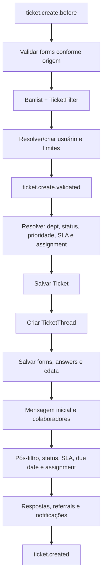

# Ciclo de vida do ticket

## Entradas de criação

| Origem | Adaptador | Guarda e chamada central |
| --- | --- | --- |
| Portal | `open.php` | login/CAPTCHA conforme configuração; `Ticket::create(..., 'Web')` |
| Agente | `scp/tickets.php` | `ticket.create`; `Ticket::open()` e depois `Ticket::create(..., 'staff')` |
| API HTTP | `TicketApiController` | API key com `canCreateTickets`; normalização e `Ticket::create()` |
| E-mail | `Fetcher` + `TicketApiController('cli')` | deduplicação/continuação por headers; cria somente se não relacionado |

Evidências: `open.php:16-61`, `scp/tickets.php:410-438`,
`include/class.ticket.php:4593-4718`, `include/api.tickets.php:113-232` e
`include/class.mailfetch.php:60-98`.

## Pipeline de `Ticket::create()`

O pipeline está em `include/class.ticket.php:4055-4589`. Os sinais anteriores à
persistência recebem dados mutáveis; o sinal final ocorre depois das
notificações. `TicketThread::create()` persiste `thread` com tipo `T`
(`include/class.thread.php:3302-3314`).

## Conversa e atividades

- `postMessage()` resolve parent de merge, usuário/colaborador, grava mensagem,
  atualiza estado e envia alertas (`class.ticket.php:3081-3269`).
- `postReply()` grava resposta, pode alterar status/claim, marca respondido e
  envia e-mail (`:3345-3459`).
- `postNote()` grava nota, pode alterar status e gera alerta (`:3509-3559`).
- `ThreadEntry::create()` sanitiza conteúdo, grava entry, anexos e metadados de
  e-mail, então emite `threadentry.created` (`class.thread.php:1639-1823`).
- colaboração é única logicamente por `(thread_id, user_id)`
  (`class.collaborator.php:179-210`).

E-mail relacionado é classificado como mensagem ou nota conforme identidade;
remetente desconhecido pode virar mensagem com aviso. O processamento bloqueia
loop de endereços do próprio sistema (`include/class.thread.php:441-620`).

## Tarefas associadas

A tarefa vinculada nasce em fluxo próprio. O AJAX exige acesso e `task.create`,
fixa ticket como objeto e chama `Task::create()`
(`include/ajax.tickets.php:1833-1883`). A criação grava tarefa, dados dinâmicos,
thread/descrição, evento, assignment e notificações
(`include/class.task.php:1458-1518`).

**Fato observado:** tarefa não integra a unidade de persistência da criação
inicial do ticket.

## Atualização, status e exclusão

`Ticket::update()` exige `ticket.edit`, valida campos base e dinâmicos, salva
respostas/forms, evento, SLA e prazo (`class.ticket.php:3675-3804`).
`updateField()` fornece caminho de campo único (`:3809-3897`).

Status `deleted` encaminha ao hard delete somente com `ticket.delete`; fechar
valida tarefas, enquanto reabrir recompõe assignment/SLA (`:1483-1602`).

`Ticket::delete()` remove primeiro a linha do ticket, depois desassocia filhos,
remove thread, forms, drafts e cdata (`:3601-3658`). `Thread::delete()` remove
anexos, colaboradores, referrals e entries e zera `thread_id` de eventos
(`class.thread.php:743-764`).

## Atomicidade e lacunas

Não foi localizada transação envolvendo Ticket, Thread, Task, formulários e
colaboradores. O pipeline contém múltiplos saves sequenciais e o schema não
possui FKs; falha intermediária pode deixar agregado parcial.

Achados ainda não classificados como defeito:

- anexos de API podem ser persistidos durante validação, antes do ticket
  (`include/api.tickets.php:70-107`); limpeza de órfãos precisa ser rastreada;
- retornos de alguns saves de forms/mensagem não são testados antes de avançar
  (`class.ticket.php:4385-4443`);
- ORM e métodos de ticket podem emitir `model.updated` mais de uma vez por
  operação (`class.orm.php:682-689`; `class.ticket.php:3800-3804,3893-3895`);
- exclusão remove a thread e depois tenta registrar evento `deleted`; o vínculo
  efetivo desse evento requer confirmação dinâmica (`ticket.php:3633-3636`).

Nenhum desses achados será corrigido antes de comparação com upstream, revisão
especializada e teste em instalação descartável.
