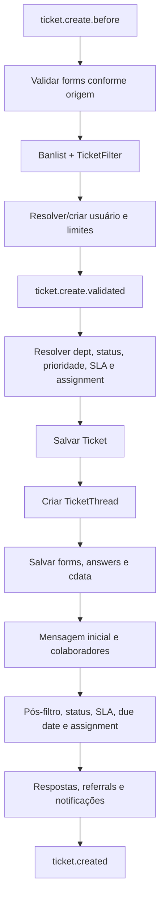

# Ciclo de vida do ticket

> O tratamento de falhas, ausência de transação, estados parciais e órfãos foi
> aprofundado em [Falhas, atomicidade e órfãos](INTEGRITY_FAILURES.md).

## Entradas de criação

| Origem | Adaptador | Guarda e chamada central |
| --- | --- | --- |
| Portal | `open.php` | login/CAPTCHA conforme configuração; `Ticket::create(..., 'Web')` |
| Agente | `scp/tickets.php` | `ticket.create`; `Ticket::open()` e depois `Ticket::create(..., 'staff')` |
| API HTTP | `TicketApiController` | API key com `canCreateTickets`; normalização e `Ticket::create()` |
| E-mail | `Fetcher` + `TicketApiController('cli')` | deduplicação/continuação por headers; cria somente se não relacionado |

Evidências: `open.php:16-61`, `scp/tickets.php:410-438`,
`include/class.ticket.php:4593-4718`, `include/api.tickets.php:113-232` e
`include/class.mailfetch.php:60-98`.

## Pipeline de `Ticket::create()`

O pipeline está em `include/class.ticket.php:4055-4589`. Os sinais anteriores à
persistência recebem dados mutáveis; o sinal final ocorre depois das
notificações. `TicketThread::create()` persiste `thread` com tipo `T`
(`include/class.thread.php:3302-3314`).

## Conversa e atividades

- `postMessage()` resolve parent de merge, usuário/colaborador, grava mensagem,
  atualiza estado e envia alertas (`include/class.ticket.php:3081-3269`).
- `postReply()` grava resposta, pode alterar status/claim, marca respondido e
  envia e-mail (`include/class.ticket.php:3345-3459`).
- `postNote()` grava nota, pode alterar status e gera alerta
  (`include/class.ticket.php:3509-3559`).
- `ThreadEntry::create()` sanitiza conteúdo, grava entry, anexos e metadados de
  e-mail, então emite `threadentry.created`
  (`include/class.thread.php:1639-1823`).
- colaboração é única logicamente por `(thread_id, user_id)`
  (`include/class.collaborator.php:179-210`).

E-mail relacionado é classificado como mensagem ou nota conforme identidade;
remetente desconhecido pode virar mensagem com aviso. O processamento bloqueia
loop de endereços do próprio sistema (`include/class.thread.php:441-620`).

## Tarefas associadas

A tarefa vinculada nasce em fluxo próprio. O AJAX exige acesso e `task.create`,
fixa ticket como objeto e chama `Task::create()`
(`include/ajax.tickets.php:1833-1883`). A criação grava tarefa, dados dinâmicos,
thread/descrição, evento, assignment e notificações
(`include/class.task.php:1458-1518`).

**Fato observado:** tarefa não integra a unidade de persistência da criação
inicial do ticket.

Na Onda 7, o endpoint nativo criou uma tarefa vinculada (`object_type=T`) ao
ticket fictício, aberta, no departamento esperado e atribuída ao agente de
visualização. Administrador e agente atribuído viram a tarefa; o cliente não
recebeu seu título no portal. O mesmo agente recebeu `403` no formulário AJAX de
criação, confirmando `task.create` nessa superfície.

A permissão `task.reply`, porém, foi aplicada somente à apresentação. O template
omite o formulário sem a permissão
(`include/staff/templates/task-view.tmpl.php:560-567`), mas o POST direto
`a=postreply` alcança `Task::postReply()` sem guarda equivalente
(`scp/tasks.php:47-72`; `include/class.task.php:1004-1051`). O runtime persistiu
uma resposta do agente sem essa permissão. Esse é um fato observado de
autorização, não uma conclusão baseada somente na leitura do template.

O agente também publicou nota interna, ação que a própria tela oferece mesmo sem
`task.reply`. Sua tentativa direta de fechamento não alterou a tarefa, mas o
AJAX respondeu `200` e reapresentou o formulário sem erro visível. Com a conta
administrativa, fechar e reabrir responderam `201`, alteraram `closed` e
persistiram as duas notas de transição. A fixture terminou novamente aberta e
nenhuma exclusão foi executada.

Essa proteção é específica de `TicketsAjaxAPI::changeStatus()`. Em contraste,
`scp/tasks.php` aceita `task:status` nos fluxos `postreply` e `postnote`, e
`Task::postReply()`/`Task::postNote()` chamam `setStatus()` sem validar
`task.close` (`scp/tasks.php:42-82`; `include/class.task.php:570-645,971-1023`).
O runtime confirmou que um `postreply` forjado pelo agente sem ambas as
permissões persistiu resposta e fechou a tarefa. A reabertura administrativa
restaurou a fixture ao estado aberto.

## Atualização, status e exclusão

`Ticket::update()` exige `ticket.edit`, valida campos base e dinâmicos, salva
respostas/forms, evento, SLA e prazo (`include/class.ticket.php:3675-3804`).
`updateField()` fornece caminho de campo único
(`include/class.ticket.php:3809-3897`).

Status `deleted` encaminha ao hard delete somente com `ticket.delete`; fechar
valida tarefas, enquanto reabrir recompõe assignment/SLA
(`include/class.ticket.php:1483-1602`).

`Ticket::delete()` remove primeiro a linha do ticket, depois desassocia filhos,
remove thread, forms, drafts e cdata (`include/class.ticket.php:3601-3658`).
`Thread::delete()` remove
anexos, colaboradores, referrals e entries e zera `thread_id` de eventos
(`include/class.thread.php:743-764`).

## Atomicidade e lacunas

Não foi localizada transação envolvendo Ticket, Thread, Task, formulários e
colaboradores. O pipeline contém múltiplos saves sequenciais e o schema não
possui FKs; falha intermediária pode deixar agregado parcial.

Achados ainda não classificados como defeito:

- anexos de API podem ser persistidos durante validação, antes do ticket
  (`include/api.tickets.php:70-107`); limpeza de órfãos precisa ser rastreada;
- retornos de alguns saves de forms/mensagem não são testados antes de avançar
  (`include/class.ticket.php:4385-4443`);
- ORM e métodos de ticket podem emitir `model.updated` mais de uma vez por
  operação (`include/class.orm.php:682-689`;
  `include/class.ticket.php:3800-3804,3893-3895`);
- exclusão remove a thread e depois tenta registrar evento `deleted`; o vínculo
  efetivo desse evento requer confirmação dinâmica
  (`include/class.ticket.php:3633-3636`).

Nenhum desses achados será corrigido antes de comparação com upstream, revisão
especializada e teste em instalação descartável.

## Confirmação comportamental inicial — Onda 7

Um cliente fictício autenticado criou ticket pelo formulário público do tópico
`Questões gerais`. Os campos de assunto e mensagem foram obtidos pelo AJAX do
tópico, o POST usou CSRF válido e a persistência confirmou ticket aberto com
thread inicial. Antes da atribuição, um agente `assigned_only` não via o ticket.

O administrador atribuiu o ticket ao agente pelo formulário AJAX e recebeu
`201`. Depois da atribuição, a fila do agente passou a incluir a referência e a
tela detalhada respondeu `200`. O cenário confirma a ligação observável entre
criação, thread, estado aberto, atribuição e filtragem por escopo.

O agente sem `ticket.reply` teve resposta direta negada e nenhuma entrada foi
persistida, mas conseguiu publicar nota interna. O `case postnote` em
`scp/tickets.php` não replica a verificação de `Ticket::PERM_REPLY` feita pelo
`case reply`; o runtime confirmou essa diferença. Em seguida, o administrador
adquiriu lock via AJAX e publicou resposta sem envio de e-mail. O cliente viu a
resposta, mas não a nota interna. Assim, tipo de entrada e autorização de escrita
são fronteiras distintas no ciclo observado.

Duas notas administrativas exercitaram transições reversíveis: Aberto para
Resolvido e Resolvido para Aberto. O `status_id` persistido mudou de `1` para `2`
e retornou a `1`. O cenário confirma fechamento e reabertura por nota com lock,
sem exclusão e preservando o ticket como fixture para tarefas e anexos.

Depois dessas transições, o cliente usou o formulário normal do portal para
publicar outra mensagem. A interface do cliente e a visão staff mostraram a
entrada, enquanto a persistência registrou uma única `type=M`, vinculada ao
usuário. `thread.lastmessage` passou a apontar para a mensagem mais recente;
`status_id=1` e `isanswered=0` permaneceram coerentes com ticket aberto
aguardando atuação da equipe.

O ciclo de atribuição também foi repetido pelo fluxo AJAX administrativo. Com o
ticket atribuído ao administrador, o agente `assigned_only` não o visualizou; a
liberação manteve o item invisível, a atribuição ao agente habilitou a tela e a
reatribuição ao administrador voltou a ocultá-la. Os três comandos retornaram
`201`, geraram eventos de liberação/atribuição e deixaram a fixture restaurada
ao administrador, sem equipe.

Um segundo ticket foi criado por visitante fictício no formulário público. A
validação rejeitou TLDs `.invalid` e `.test` sem persistência; `example.com` foi
aceito e produziu usuário, ticket Web aberto e thread. Outro cliente inicialmente
não tinha a linha nem acesso direto. Após o administrador adicioná-lo pelo
diálogo de colaboradores, `thread_collaborator` ganhou uma relação, lista e tela
passaram a incluir o ticket e o cliente publicou uma mensagem `M`. A operação
preservou o usuário proprietário e atualizou `thread.lastmessage` para a nova
mensagem.

O mesmo segundo ticket percorreu a edição administrativa tradicional. O assunto
dinâmico foi alterado e restaurado em dois POSTs `a=edit`; a visão
`ticket__cdata` terminou com o valor original e sem marcador temporário. A ação
relativa `tickets.php` precisou ser resolvida no contexto `/scp`, evidenciando
que o shell faz parte do contrato de navegação mesmo quando o controlador final
é o mesmo arquivo.

Uma terceira abertura pública foi executada com coletor SMTP restrito a
`127.0.0.1`, sem relay. O ticket Web aberto foi persistido para o usuário
fictício existente e o coletor aceitou uma mensagem com um destinatário. Isso
confirma que o ciclo de criação pode alcançar o transporte de saída sem impedir
a persistência. O ensaio não registrou endereços ou conteúdo, portanto não
distingue autoresposta de alerta interno.

A classificação subsequente confirmou que a mensagem da abertura foi alerta
interno. O autoresponder global estava desligado, embora tópico e departamento
o permitissem; o alerta de novo ticket e o destinatário administrador estavam
ativos. O gerente estava selecionado na política, mas o departamento não tinha
gerente, resultando em um único destinatário efetivo.

Na resposta staff com e-mail, o primeiro POST sem aquisição AJAX de lock foi
recusado sem persistência. Depois do lock, `reply-to=user` criou uma entrada
`R`, manteve o ticket aberto, mudou `isanswered` para verdadeiro e atualizou
`thread.lastresponse`; `thread.lastmessage` permaneceu apontando para a última
mensagem do cliente. O transporte local recebeu uma mensagem destinada ao
domínio reservado do proprietário. Isso confirma separadamente os relógios de
mensagem e resposta da thread.

Quando o colaborador publicou outra mensagem no portal, uma nova entrada `M`
atualizou `lastmessage`, preservou `lastresponse` e marcou o ticket como não
respondido. A notificação foi enviada somente ao proprietário; o autor não
recebeu autoresposta e nenhum agente recebeu alerta porque o ticket não tinha
atribuído, respondente anterior ou gerente elegível. O namespace de draft do
cliente estava vazio antes e depois da limpeza automática do controlador.
